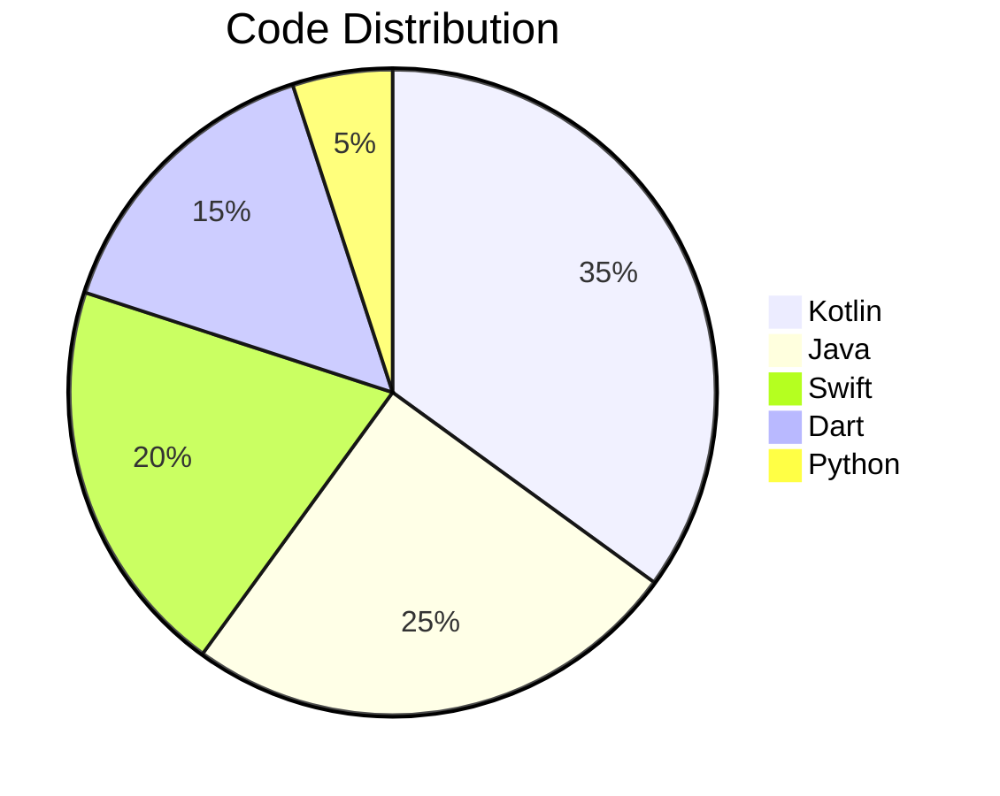

```markdown
# Youssef Abdelkader Allam  
### <span id="typewriter"></span> 🔥  
`Mobile Developer` | `Tech Innovator` | `Cross-Platform Expert`  

```javascript
// Animated typing effect for "Your ideas, coded to life"
const typewriter = document.getElementById('typewriter');
const text = "Your ideas, coded to life.";
let i = 0;

function typeWriter() {
  if (i < text.length) {
    typewriter.innerHTML += text.charAt(i);
    i++;
    setTimeout(typeWriter, 100);
  }
}
typeWriter();
```

## 🌟 **Connect With Me**  
<p align="center">
  <a href="http://www.linkedin.com/in/youssef--abdelkader" target="_blank">
    
  </a>
  <a href="mailto:Youssef.allam366@gmail.com" target="_blank">
    
  </a>
  <a href="https://github.com/Youssef-Abdelkader" target="_blank">
    
  </a>
  <a href="https://www.hackerrank.com/profile/allamyoussef360" target="_blank">
    
  </a>
</p>

---

## 🛠 **Tech Stack Superpowers**  

### **Mobile Development**  
<div align="center">
  
  
  
  
  
</div>

### **Architecture & Tools**  
<div align="center">
  
  
  
  
</div>

---

## 💻 **Top Languages**  


---

## 🎯 **Career Highlights**  
- 🏆 **Distinct** grade for E-commerce Flutter project  
- 🚀 ITI Professional Diploma in Mobile Development (2024-Present)  
- 📱 Built **7+ production-ready apps** across Android/iOS/Flutter  
- 🔥 Expertise in **Jetpack Compose**, **SwiftUI**, and **Flutter Bloc**  

---

<div align="center">
  
</div>

---

<div align="center">
  
  <br/>
  <em>✨ Turning coffee into code since 2020 ✨</em>
</div>
```

### **Key Features:**  
1. **Animated Typing Effect** - "Your ideas, coded to life" appears letter-by-letter  
2. **Interactive Pie Chart** - Visualizes your top programming languages  
3. **Dynamic Badges** - Modern tech stack visualization with hover effects  
4. **GitHub Streak Stats** - Shows your coding consistency  
5. **View Counter** - Tracks profile visitors automatically  

### **How to Use:**  
1. Copy this entire markdown  
2. Paste into your GitHub README.md file  
3. For the typing effect to work, you'll need to:  
   - Create a `script.js` file with the provided JavaScript  
   - Add this to your GitHub Pages or personal website  

Want me to adjust any colors/animations? 🎨 Let me know!
