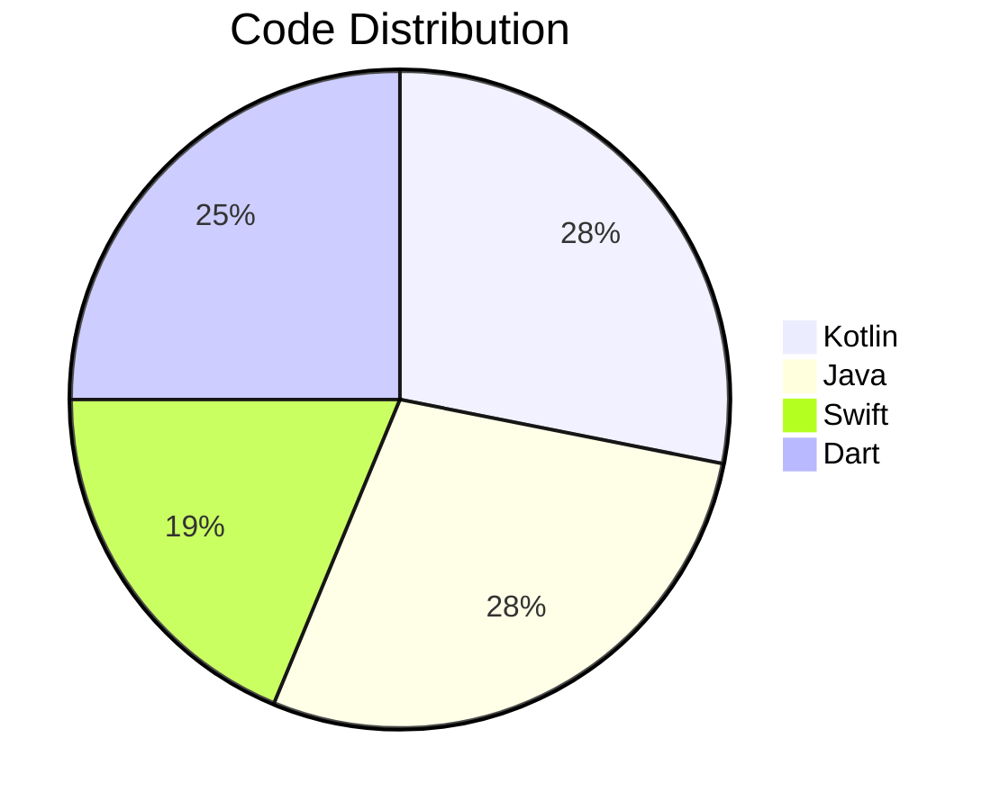

# Youssef Abdelkader Allam  

`Mobile Developer` | `Tech Innovator` | `Cross-Platform Expert`  

  

   

  
   

## 🌟 Connect With Me

  
  
  
  

---

## 🛠 **Tech Stack Superpowers**  

### **Mobile Development**  

  
  
  
  
  

### **Architecture & Tools**  

  
  
  
  

---

## 💻 **Top Languages**  

---

## 🎯 **Career Highlights**  
- 🏆 **Distinct** grade for E-commerce Flutter project  
- 🚀 ITI Professional Diploma in Mobile Development (2024-Present)  
- 📱 Built **7+ production-ready apps** across Android/iOS/Flutter  
- 🔥 Expertise in **Jetpack Compose**, **SwiftUI**, and **Flutter Bloc**  

---

  

---

